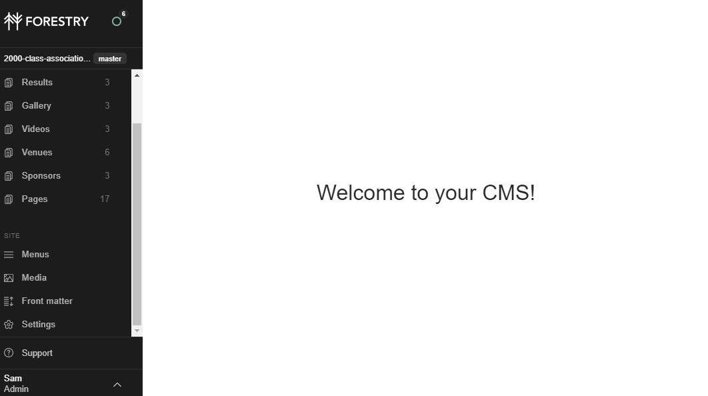

# Adding Documents

Documents can be uploaded onto some specific content types (for instance Events) or via the Media Manager. When added to a specific content type they will usually automatically appear on the page for that item.

When added to the media manager they need to be individually linked to following the procedure below.

# Adding Document Links

1. Log into Forestry and open the correct site (following [this guide](README.md))
2. Click "Media" on the sidebar to open the Media Manager
3. Select the item you want to link to
4. On the right hand sidebar click ```Copy URL``` under the item name
5. Go to the page/content you want to add your link in
6. Highlight the text you want to turn into a link
7. Click the link/paperclip icon on the bottom editor bar
8. Enter a name (displayed when you hover over the link)
9. Paste the copied URL to the URL box
10. Click Save

The GIF below illustrates this procedure.

