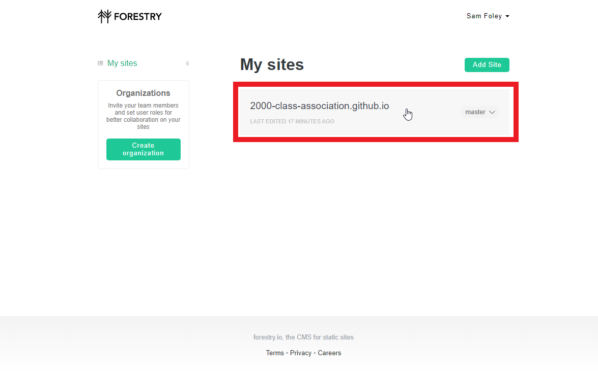
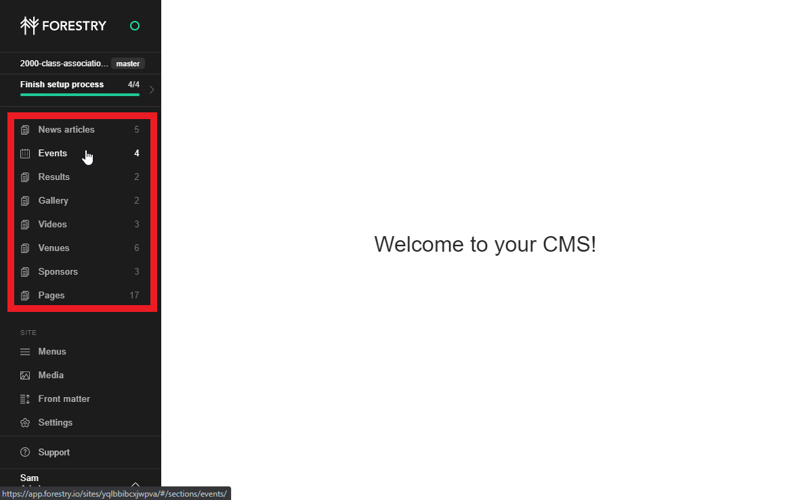
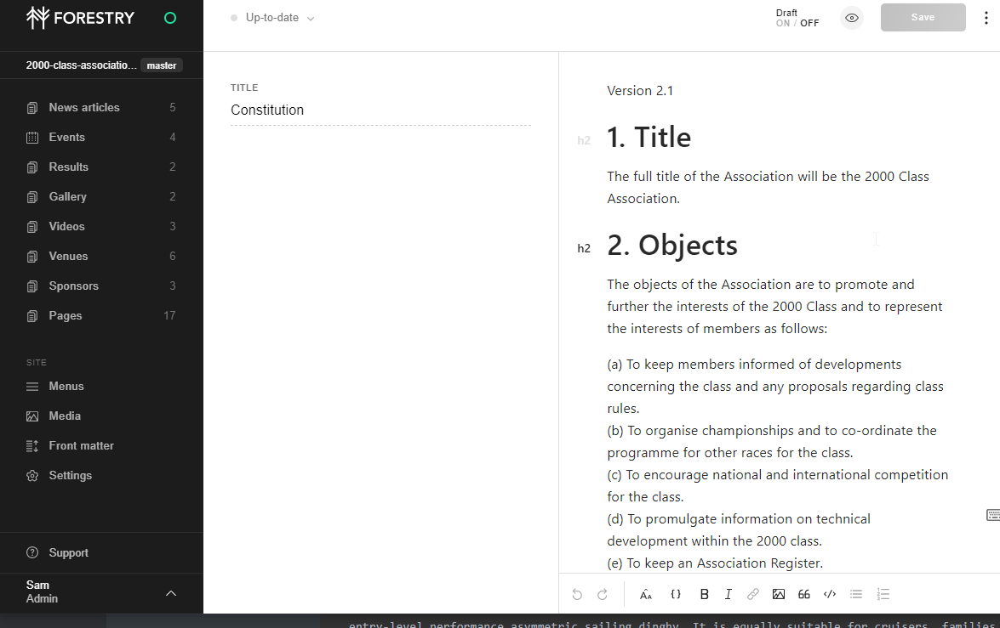

[TOC]

# Basic Login and Editing

1. Login to Forestry.io

   Visit https://app.forestry.io/login and login. If you don't have a login speak to whoever administers the site to get one.

	

2. Open the required main site

   

3. You will see the menu bar on the left hand side listing the various content types on the site. You can add or edit any of these items.

   

# Editing Existing Content

You can edit existing content such as the home page text. ***However*** please be aware that you should avoid changing anything you do not understand in these files. Modifying text will generate the expected response but modifying content within code tags can have significant implications to the way the site appears or function.

To edit a page simply browse using the menu on the left to the category and then find the item in question on the right.

Only some files will contain these code tags, other will be fully editable.

For example the file below is safe to completely edit:



However this file contains tags and needs to be edited with care:


It can be seen below with highlighting, editing any of the coloured text may change the site.

```html


<p>The <i>2000 Class Association</i> is run by keen volunteer 2000-dinghy sailors. The LDC 2000, formerly known as the Laser 2000, is an entry-level performance asymmetric sailing dinghy. It is equally suitable for cruisers, families as well as serious racers.</p>

<p>The association organises a UK national circuit "Millennium Series", National Championships, Welsh Championships and Inlands Championships. It also delivers training sessions and provides support/advice for all.<p> 


<p>Do you sail a 2000? <a href="{{ "/about/join.html" | absolute_url }}">Become a member today</a>.</p>

```

***Please be cautious when editing existing content with these kind of code blocks in them and if you are unsure ask for help.***

When you are finished editing just click save to immediately save and publish your content.

# Adding Content Resources

Resources can be added in much the same way as they can be modified. There are a few things to take into account for specific resources so please check here and if you are unsure about anything ASK the person who gave you the access and showed you how to edit content!

- **All content defaults to Draft mode, this can be turned off by clicking the indicator next to the save button so content will be displayed.** 
- All content types apart from Venues and Sponsors are sorted (usually in reverse order) by date.

**Pages**

- When adding pages browse to the directory you want the page to be shown in before selecting Create New.
- Pages do not automatically show up on the menus, if they need to appear on the menu manual editing of the menu file is required.
  - Rules & Guides pages ARE automatically added to the Rules&Guides listing home page

**Results**

Results are added direct from the Sailwave HTML export file and detailed instructions for that are contained [here](./Results Uploading.md).
