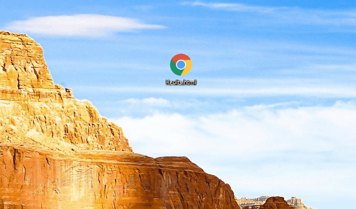

# Uploading Results

Results can be uploaded using the forestry.io CMS, basic usage information for this can be found [here](./README.md).

## General Upload Procedure

The procedure for uploading results is as follows:

1. Export from Sailwave to HTML/HTM
2. Open the HTML file and copy out the ```<div>``` element containing the report data.
3. Login into Forestry.io and create the new results content
4. Paste the copied data into the content window
   ***When this is copied in a dialog box to configure the link at the bottom of the pasted content will appear. Click Delete on this to preserve proper formatting!***
5. Add the title, date and time of the race/results.
6. If wanting to publish immediately turn off draft, click Save.

## Upload using Google Chrome

To do this specifically in Google Chrome you can:

1. Open the Sailwave Export
2. Press **F12** to open DevTools
3. Expand the elements in the tree to find the first div containing headings.
4. Right-click on it and select ```Copy -> Copy OuterHTML```
5. Complete steps 3-5 from the general procedure above

This can be seen in the Gif below.

